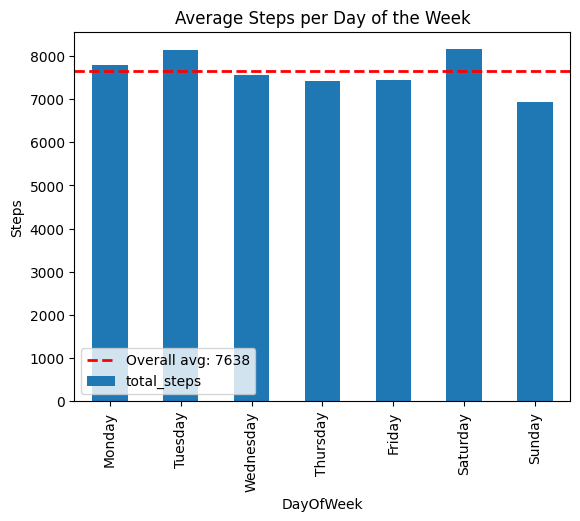
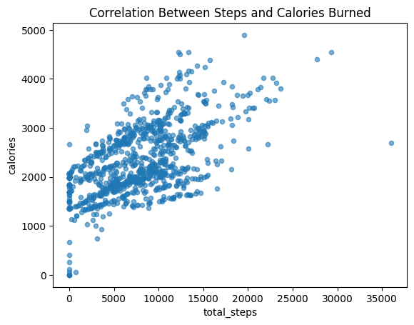
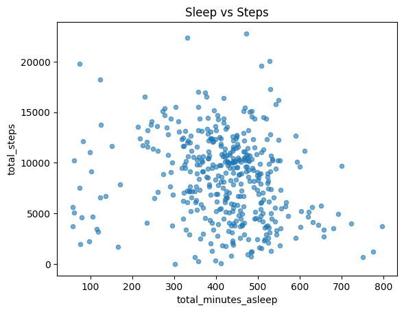
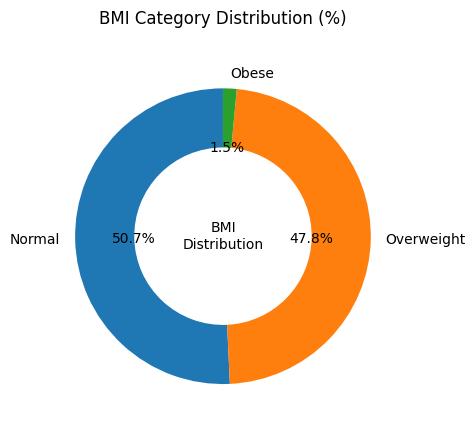
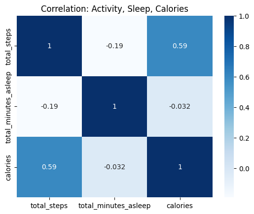

#  Bellabeat Smart Wellness Report  
### Phase 5: Share — Turning Data Into a Story  
*Prepared by: Vibhanshu Dubey*  

---

## 💬 Executive Summary  
Fitbit data reveals a story of motivation, imbalance, and opportunity.  
Users start strong but lose rhythm midweek, spend most of their time sedentary, and often trade rest for activity.  
This creates a perfect opening for **Bellabeat** to guide women toward **balanced, consistent wellness** through smart, empathetic insights.

---

## 🚶‍♀️ Movement Patterns  
  
Users are **most active on Saturday, Tuesday, and Monday**, but activity dips **midweek and Sundays**.  
**➡ Insight:** Motivation fades midweek — Bellabeat can boost engagement with **midweek reminders and friendly challenges**.

---

## 🔥 Activity & Calories  

A **moderate positive correlation (r = 0.59)** shows that **more steps = more calories burned**.  
**➡ Insight:** Real-time calorie feedback and progress visuals can help users **see and celebrate small wins**.

---

## 💤 Sleep Balance  

A **weak negative correlation (r = -0.19)** suggests active users sleep slightly less.  
**➡ Insight:** Bellabeat can promote **“rest days” and mindfulness tips** to support full-body wellness.

---

## 🪑 Daily Activity Distribution  

Over **80% of the day is sedentary** — users move, but not enough.  
**➡ Insight:** Introduce **micro-movement goals** like “2-minute stretch breaks” or gentle nudges to stand and move.

---

## ⚖️ BMI Overview  

Average **BMI = 25.2** → **50.7% normal**, **47.8% overweight**, **1.5% obese**.  
**➡ Insight:** Focus on **healthy habit coaching**, not just activity tracking — balance fitness, rest, and nutrition.

---

## 🔗 Health Correlations  

- Steps ↔ Calories → **r = 0.59 (positive)**  
- Sleep ↔ Steps → **r = -0.19 (weak negative)**  
**➡ Insight:** Users chase activity but lack recovery balance — Bellabeat can become the **bridge between movement and mindfulness**.

---

## ✨ Summary Snapshot  

| Focus Area | Key Insight | Opportunity for Bellabeat |
|-------------|--------------|-----------------------------|
| Movement | Active early week, drop midweek | Midweek challenges & reminders |
| Calories | Steps drive calorie burn | Add real-time progress visuals |
| Sleep | Slight trade-off with activity | Promote rest awareness |
| Sedentary Time | 80% inactive hours | Micro-movement goals |
| BMI | Slightly overweight trend | Lifestyle habit guidance |

---

## 💡 Closing Thought  
> Users are motivated but inconsistent.  
> Bellabeat can transform awareness into **actionable, balanced wellness** — where every step, rest, and routine feels rewarding.

---

**Prepared for:** Bellabeat Stakeholders  
**By:** Vibhanshu Dubey   
**Date:** 02/11/2025  

